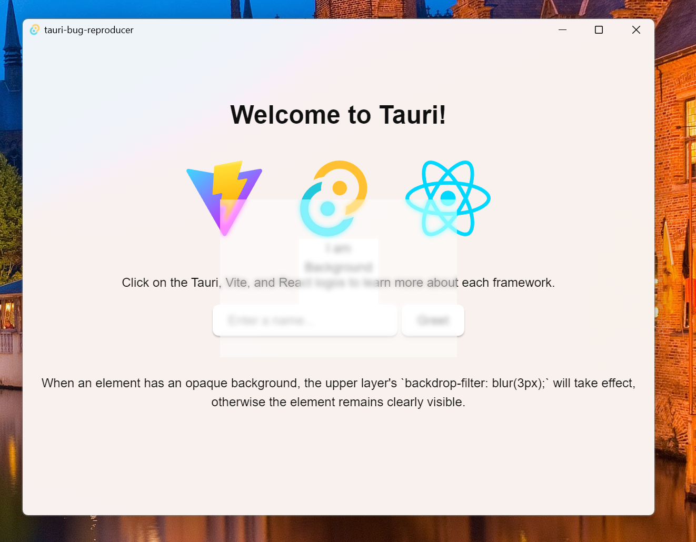

# Windows css blur not working on mica

When an element has an opaque background, the upper layer's `backdrop-filter: blur(3px);` will take effect, otherwise the element remains clearly visible.

## Reproduction conditions:

1. Under windows
2. Use setEffects to add effect to window

## Screenshot



## How to start

```bash
pnpm install
pnpm tauri dev
```
